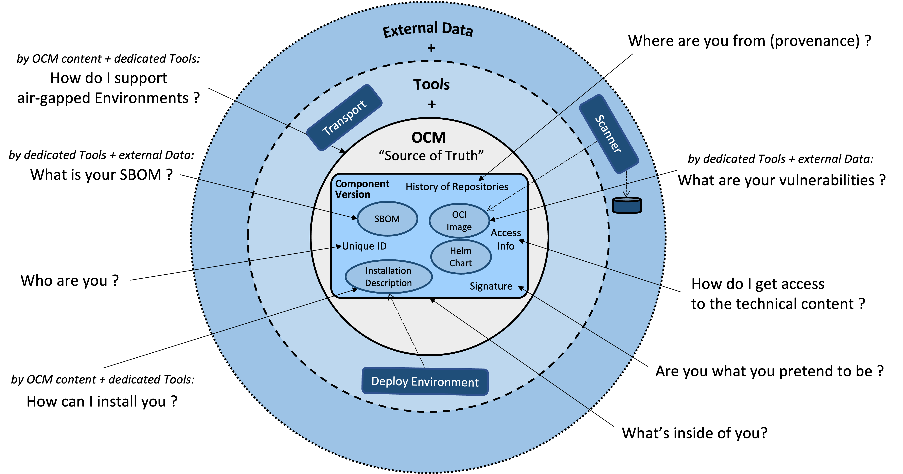

# Open Component Model (OCM)

The _Open Component Model (OCM)_ is an open standard to describe software-bill-of-deliveries (SBOD). OCM is a technology-agnostic and machine-readable format focused on the software artifacts that must be delivered for software products. OCM provides a globally unique identity scheme which can be used to identify components and artifacts throughout the entire software lifecycle management process,...

Its focus is describing versioned sets of artifacts and to assign globally unique identities. OCM makes those artifacts queryable: what is inside, where is it from, is it authentic, etc. But it does not deal with building those artifacts or how to deploy them. Such tasks are left to tools on top of the model. In this way, they are able to access the artifact by its identity. Different tools may keep their own metadata bound together by the identities provided by the model.

OCM provides a common language usable by tools to talk about software artifacts, regardless of the technologies and the processes working on them. Tool specific metadata, like deployment descriptions, are handled as own, typed artifacts. This enables the provisioning of content-agnostic tools: for example, transporting software between environments, signing and verification, providing compliance data, etc.

The following chapters provide a formal description of the format to describe software artifacts and a storage layer to persist those and make them available from remote.

## Specification

### Core Parts

* 1. [Model](doc/01-model/README.md)
  * 1.1 [OCM Model](doc/01-model/01-model.md#ocm-model)
    * 1.1.1 [Introduction](doc/01-model/01-model.md#introduction)
    * 1.1.2 [Components and Component Versions](doc/01-model/01-model.md#components-and-component-versions)
    * 1.1.3 [Component Repositories](doc/01-model/01-model.md#component-repositories)
    * 1.1.4 [Summary](doc/01-model/01-model.md#summary)
  * 1.2. [Model Elements](doc/01-model/02-elements-toplevel.md#model-elements)
    * 1.2.1 [Components and Component Versions](doc/01-model/02-elements-toplevel.md#components-and-component-versions)
    * 1.2.2 [Artifacts (Resources and Sources)](doc/01-model/02-elements-toplevel.md#artifacts-resources-and-sources)
    * 1.2.3 [Sources](doc/01-model/02-elements-toplevel.md#sources)
    * 1.2.4 [Resources](doc/01-model/02-elements-toplevel.md#resources)
    * 1.2.5 [References](doc/01-model/02-elements-toplevel.md#references)
    * 1.2.6 [Summary](doc/01-model/02-elements-toplevel.md#summary)
  * 1.3. [Model Elements - Fundamentals](doc/01-model/03-elements-sub.md)
    * 1.3.1 [Identifiers](doc/01-model/03-elements-sub.md#identifiers)
    * 1.3.2 [Access Specification](doc/01-model/03-elements-sub.md#access-specification)
    * 1.3.3 [Access Types](doc/01-model/03-elements-sub.md#access-types)
    * 1.3.4 [Labels](doc/01-model/03-elements-sub.md#labels)
    * 1.3.5 [Repository Contexts](doc/01-model/03-elements-sub.md#repository-contexts)
    * 1.3.6 [Signatures](doc/01-model/03-elements-sub.md#signatures)
    * 1.3.7 [Digest Info](doc/01-model/03-elements-sub.md#digest-info)
    * 1.3.8 [Signature Info](doc/01-model/03-elements-sub.md#signature-info)
  * 1.4 [Example of a complete Component Version](doc/01-model/04-example.md#example-of-a-complete-component-version)
  * 1.5 [Conventions](doc/01-model/06-conventions.md#conventions)
    * 1.5.1 [Intended Environments](doc/01-model/06-conventions.md#intended-environments)
    * 1.5.2 [Selection of Usage Scenarios](doc/01-model/06-conventions.md#selection-of-usage-scenarios)
  * 1.6 [Extending the Open Component Model](doc/01-model/07-extensions.md#extending-the-open-component-model)
    * 1.6.1 [Functional extensions](doc/01-model/07-extensions.md#functional-extensions)
    * 1.6.2 [Semantic extensions](doc/01-model/07-extensions.md#semantic-extensions)
* 2. [Processing](doc/02-processing/README.md)
  * 2.1 [Referencing](doc/02-processing/01-references.md#referencing)
    * 2.1.1 [Example](doc/02-processing/01-references.md#example)
  * 2.2 [Signing](doc/02-processing/02-signing.md#signing)
    * 2.2.1 [Verification Procedure](doc/02-processing/02-signing.md#verification-procedure)
  * 2.3 [Normalization](doc/02-processing/03-signing-process.md#signing-process-and-normalization)
    * 2.3.1 [Artifact Digest](doc/02-processing/03-signing-process.md#determing-the-artifact-digests)
    * 2.3.2 [Normalization Types](doc/02-processing/03-signing-process.md#normalization-types)
    * 2.3.3 [Serialization Format](doc/02-processing/03-signing-process.md#serialization-format)
    * 2.3.4 [Recursive Digest Calculation](doc/02-processing/03-signing-process.md#recursive-digest-calculation)
  * 2.4 [Example](doc/02-processing/04-signing-examples.md#examples-for-signing-of-component-version)
    * 2.4.1 [Simple Component-Version](doc/02-processing/04-signing-examples.md#simple-component-version)
    * 2.4.2 [Component-Version With Reference](doc/02-processing/04-signing-examples.md#component-version-with-reference)
  * 2.5 [Component Descriptor Normalization](doc/02-processing/04-signing-examples.md#component-descriptor-normalization)
    * 2.5.1 [Signing-relevant information in Component Descriptors](doc/02-processing/04-signing-examples.md#relevant-information-in-component-descriptors)
    * 2.5.2 [Exclude Resources from Normalization/Signing](doc/02-processing/05-component-descriptor-normalization.md#exclude-resources-from-normalizationsigning)
    * 2.5.3 [Generic Normalization Format](doc/02-processing/05-component-descriptor-normalization.md#generic-normalization-format)
  * 2.6 [Artifact Normalization](doc/02-processing/06-artifact-normalization.md#artifact-normalization)
    * 2.6.1 [Blob Representation Format for Resource Types](doc/02-processing/06-artifact-normalization.md#blob-representation-format-for-resource-types)
    * 2.6.2 [Interaction of Local Blobs, Access Methods, Uploaders and Media Types](doc/02-processing/06-artifact-normalization.md#interaction-of-local-blobs-access-methods-uploaders-and-media-types)
* 3. [Persistence](doc/03-persistence/README.md)
  * 3.1 [Model Operations](doc/03-persistence/01-operations.md#model-operations)
  * 3.2 [Abstract Operations defined by the Open Component Model](doc/03-persistence/01-operations.md#abstract-operations-defined-by-the-open-component-model)
    * 3.2.1 [Repository Operations](doc/03-persistence/01-operations.md#repository-operations)
    * 3.2.2 [Access Method Operations](doc/03-persistence/01-operations.md#access-method-operations)
  * 3.3. [Mappings for OCM Persistence](doc/03-persistence/02-mappings.md#mappings-for-ocm-persistence)
    * 3.3.1 [Storage Backend Mappings for the Open Component Model](doc/03-persistence/02-mappings.md#storage-backend-mappings-for-the-open-component-model)

### Extensible Parts

* 4 [Extensions](doc/04-extensions/README.md)
* 4.1 [Artifact Types](doc/04-extensions/01-artifact-types/README.md)
  * 4.1.1 [blob](doc/04-extensions/01-artifact-types/blob.md)
  * 4.1.2 [directoryTree, fileSystem](doc/04-extensions/01-artifact-types/file-system.md)
  * 4.1.3 [gitOpsTemplate](doc/04-extensions/01-artifact-types/gitops.md)
  * 4.1.4 [helmChart](doc/04-extensions/01-artifact-types/helmchart.md)
  * 4.1.5 [npmPackage](doc/04-extensions/01-artifact-types/npm.md)
  * 4.1.6 [ociArtifact](doc/04-extensions/01-artifact-types/oci-artifact.md)
  * 4.1.7 [ociImage](doc/04-extensions/01-artifact-types/oci-image.md)
  * 4.1.8 [executable](doc/04-extensions/01-artifact-types/executable.md)
  * 4.1.9 [sbom](doc/04-extensions/01-artifact-types/sbom.md)
* 4.2 [Access Method Types](doc/04-extensions/02-access-types/README.md)
  * 4.2.1 [localBlob](doc/04-extensions/02-access-types/localblob.md)
  * 4.2.2 [ociArtifact](doc/04-extensions/02-access-types/ociartifact.md)
  * 4.2.3 [ociBlob](doc/04-extensions/02-access-types/ociblob.md)
  * 4.2.4 [helm](doc/04-extensions/02-access-types/helm.md)
  * 4.2.5 [gitHub](doc/04-extensions/02-access-types/github.md)
  * 4.2.6 [s3](doc/04-extensions/02-access-types/s3.md)
  * 4.2.7 [npm](doc/04-extensions/02-access-types/npm.md)
* 4.3 [Storage Backend Mappings](doc/04-extensions/03-storage-backends/README.md)
  * 4.3.1 [OCIRegistry](doc/04-extensions/03-storage-backends/oci.md)
  * 4.3.2 [FileSystem (CTF)](doc/04-extensions/03-storage-backends/ctf.md)
  * 4.3.3 [FileSystem (Component Archive)](doc/04-extensions/03-storage-backends/component-archive.md)
  * 4.3.4 [AWS S3](doc/04-extensions/03-storage-backends/s3.md)
* 4.4 [Algorithms](doc/04-extensions/04-algorithms/README.md)
  * 4.4.1 [Artifact Normalization](doc/04-extensions/04-algorithms/artifact-normalization-types.md)
  * 4.4.2 [Digest Algorithms](doc/04-extensions/04-algorithms/label-merge-algorithms.md)
  * 4.4.3 [Label Merge Algorithm](doc/04-extensions/04-algorithms/digest-algorithms.md)
  * 4.4.4 [Component Descriptor Normalization Algorithms](doc/04-extensions/04-algorithms/component-descriptor-normalization-algorithms.md)
  * 4.4.5 [Signing Algorithms](doc/04-algorithms/04-algorithms/signing-algorithms.md)

### Guidelines and Conventions

* 5. [Guidelines](doc/05-guidelines/README.md)
  * 5.1 [Transport](doc/05-guidelines/01-transport.md#transport)
    * 5.1.1 [Kinds of Transports](doc/05-guidelines/01-transport.md#kinds-of-transports)
  * 5.2 [Model Contract](doc/05-guidelines/02-contract.md#model-contract)
    * 5.2.1 [Example: Helm deployment](doc/05-guidelines/02-contract.md#example-helm-deployment)
  * 5.3 [References](doc/05-guidelines/03-references.md#references)
    * 5.3.1 [Relative Artifact References](doc/05-guidelines/03-references.md#relative-artifact-references)
    * 5.3.2 [Absolute Artifact References](doc/05-guidelines/03-references.md#absolute-artifact-references)

### Glossary

* 6. [Glossary](doc/glossary.md)

## Central OCM project web page

Check out the main project [web page](https://ocm.software) to find out more about OCM. It is your central entry point to all kinds of ocm related [docs and guides](https://ocm.software/docs/overview/context/), this [spec](https://ocm.software/spec/) and all project-related [github repositories](https://github.com/open-component-model). It also offers a [Getting Started](https://ocm.software/docs/guides/getting-started-with-ocm) to quickly make your hands dirty with ocm, its toolset and concepts :-)

## Contributing

Code contributions, feature requests, bug reports, and help requests are very welcome. Please refer to the [Contributing Guide in the Community repository](https://github.com/open-component-model/community/blob/main/CONTRIBUTING.md) for more information on how to contribute to OCM.

OCM follows the [CNCF Code of Conduct](https://github.com/cncf/foundation/blob/main/code-of-conduct.md).

## Licensing

Copyright 2022 SAP SE or an SAP affiliate company and Open Component Model contributors.
Please see our [LICENSE](LICENSE) for copyright and license information.
Detailed information including third-party components and their licensing/copyright information is available [via the REUSE tool](https://api.reuse.software/info/github.com/open-component-model/ocm-spec).
