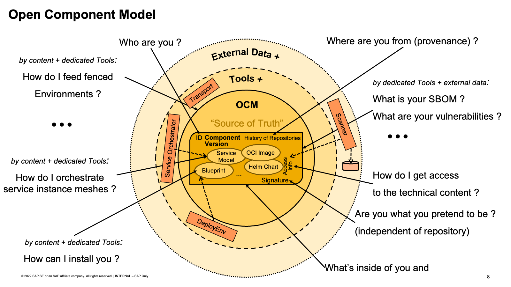

# Open Component Model (OCM)

The _Open Component Model (OCM)_ is an open standard to describe software-bill-of-deliveries (SBOD). OCM is a technology-agnostic and machine-readable format focused on the software artifacts that must be delivered for software products. OCM provides a globally unique identity scheme throughout the entire software lifecycle management process, from build to compliance, to deployment. OCM makes software artifacts queriable: what is inside, where is it from, is it authentic etc.

The following chapters provide a formal description of the format to describe software artifacts and a storage layer to persist those and make them available from remote.

## Specification
1. [Model](doc/01-model/README.md)
   1. [OCM Model](doc/01-model/01-model.md#ocm-model)
      1. [Components and Component Versions](doc/01-model/01-model.md#components-and-component-versions)
      2. [Component Repositories](doc/01-model/01-model.md#component-repositories)
      3. [Summary](doc/01-model/01-model.md#summary)
   2. [Model Elements](doc/01-model/02-elements.md#model-elements)
      1. [Components and Component Versions](doc/01-model/02-elements.md#components-and-component-versions)
      2. [Artifacts (Resources and Sources)](doc/01-model/02-elements.md#artifacts-resources-and-sources)
      3. [Sources](doc/01-model/02-elements.md#sources)
      4. [Resources](doc/01-model/02-elements.md#resources)
      5. [References](doc/01-model/02-elements.md#references)
      6. [Identifiers](doc/01-model/02-elements.md#identifiers)
      7. [Access Specification](doc/01-model/02-elements.md#access-specification)
      8. [Labels](doc/01-model/02-elements.md#labels)
      10. [Repository Contexts](doc/01-model/02-elements.md#repository-contexts)
      11. [Signatures](doc/01-model/02-elements.md#signatures)
      12. [Digest Info](doc/01-model/02-elements.md#digest-info)
      13. [Signature Info](doc/01-model/02-elements.md#signature-info)
   3. [Example for a complete Component Version](doc/01-model/03-example.md#example-for-a-complete-component-version)
   4. [Extending the Open Component Model](doc/01-model/04-extensions.md#extending-the-open-component-model)
      1. [Functional extensions](doc/01-model/04-extensions.md##functional-extensions)
      2. [Semantic extensions](doc/01-model/04-extensions.md##semantic-extensions)
   * 5.[Model Contract](doc/05-contract.md#model-contract)
     * 5.1.[Example: Helm deployment](doc/05-contract.md#example-helm-deployment)
   * 6. [Conventions](doc/06-conventions.md#conventions)
     * 6.1 [Intended Environments](doc/06-conventions.md#intended-environments)
     * 6.2 [Selection of Usage Scenarios](06-conventions.md#selection-of-usage-scenarios)
2. [Processing OCM](doc/02-processing/README.md)
   1. [Referencing](doc/02-processing/01-references.md#referencing)
      1. [Relative Artifact References](doc/02-processing/01-references.md#relative-artifact-references)
      2. [Absolute Artifact References](doc/02-processing/01-references.md#absolute-artifact-references)
   2. [Transport](doc/02-processing/02-transport.md#transport)
   3. [Signing](doc/02-processing/03-signing.md#signing)
      1. [Signing Algorithms](doc/02-processing/03-signing.md#signing-algorithms)
         1. [RSA](doc/02-processing/03-signing.md#rsa)
      2. [Verification Procedure](doc/02-processing/03-signing.md#verification-procedure)
         1. [Verify with RSA](doc/02-processing/03-signing.md#verify-with-rsa)
         2. [Verify with X509](doc/02-processing/03-signing.md#verify-with-x509)
   4. [Normalization](doc/02-processing/04-digest.md#normalization)
      1. [Artifact Digest](doc/02-processing/04-digest.md#artifact-digest)
         1. [Digest Algorithms](doc/02-processing/04-digest.md#digest-algorithms)
      2. [Normalization Types](doc/02-processing/04-digest.md#normalization-types)
      3. [Serialization Format](doc/02-processing/04-digest.md#serialization-format)
      4. [Recursive Digest Calculation](doc/02-processing/04-digest.md#recursive-digest-calculation)
   5. [Example](doc/02-processing/04-digest.md#example)
      1. [Simple Component-Version](doc/02-processing/04-digest.md#simple-component-version)
      2. [Component-Version With Reference](doc/02-processing/04-digest.md#component-version-with-reference)
   6. [Component Descriptor Normalization](doc/02-processing/04-digest.md#component-descriptor-normalization)
      1. [`jsonNormalisationV1` vs `jsonNormalisationV2`](doc/02-processing/04-digest.md#jsonnormalisationv1-vs-jsonnormalisationv2)
      2. [Relevant information in Component Descriptors](doc/02-processing/04-digest.md#relevant-information-in-component-descriptors)
         1. [Access Methods](doc/02-processing/04-digest.md#access-methods)
      3. [Labels](doc/02-processing/04-digest.md#labels)
      4. [Exclude Resources from Normalization/Signing](doc/02-processing/04-digest.md#exclude-resources-from-normalizationsigning)
      5. [Generic Normalization Format](doc/02-processing/04-digest.md#generic-normalization-format)
         1. [Simple Values](doc/02-processing/04-digest.md#simple-values)
         2. [Dictionary](doc/02-processing/04-digest.md#dictionary)
         3. [Lists](doc/02-processing/04-digest.md#lists)
         4. [Combined example](doc/02-processing/04-digest.md#combined-example)
         5. [Empty values:](doc/02-processing/04-digest.md#empty-values)
   7. [Artifact Normalization](doc/02-processing/04-digest.md#artifact-normalization)
      1. [Blob Representation Format for Resource Types](doc/02-processing/04-digest.md#blob-representation-format-for-resource-types)
      2. [Interaction of Local Blobs, Access Methods, Uploaders and Media Types](doc/02-processing/04-digest.md#interaction-of-local-blobs-access-methods-uploaders-and-media-types)
         1. [Access Methods](doc/02-processing/04-digest.md#access-methods-1)
         2. [Blob Uploaders](doc/02-processing/04-digest.md#blob-uploaders)

3. [Operations](doc/03-operations/README.md)
   1. [Model Operations](doc/03-operations/01-operations.md#model-operations)
   2. [2.2 Abstract Operations defined by the Open Component Model](doc/03-operations/01-operations.md#abstract-operations-defined-by-the-open-component-model)
      1. [Repository Operations](doc/03-operations/01-operations.md#repository-operations)
         1. [Mandatory Operations](doc/03-operations/01-operations.md#mandatory-operations)
         2. [Optional Operations](doc/03-operations/01-operations.md#optional-operations)
      2. [Access Method Operations](doc/03-operations/01-operations.md#access-method-operations)
4. [Persistence](doc/04-persistence/README.md)
   1. [Mappings for OCM Persistence](doc/04-persistence/01-mappings.md#mappings-for-ocm-persistence)
      1. [Storage Backend Mappings for the Open Component Model](doc/04-persistence/01-mappings.md#storage-backend-mappings-for-the-open-component-model)
   2. [OCI Registries](doc/04-persistence/02-oci.md#oci-registries)
      1. [Specification Format](doc/04-persistence/02-oci.md#specification-format)
         1. [Synopsis](doc/04-persistence/02-oci.md#synopsis)
         2. [Description](doc/04-persistence/02-oci.md#description)
         3. [Specification Versions](doc/04-persistence/02-oci.md#specification-versions)
            1. [Version v1](doc/04-persistence/02-oci.md#version-v1)
      2. [Element Mapping](doc/04-persistence/02-oci.md#element-mapping)
      3. [Version Mapping](doc/04-persistence/02-oci.md#version-mapping)
      4. [Blob Mappings](doc/04-persistence/02-oci.md#blob-mappings)
   3. [Common Transport Format (CTF)](doc/04-persistence/03-files.md#common-transport-format-ctf)
      1. [Specification Format](doc/04-persistence/03-files.md#specification-format)
         1. [Synopsis](doc/04-persistence/03-files.md#synopsis)
         2. [Description](doc/04-persistence/03-files.md#description)
         3. [Specification Versions](doc/04-persistence/03-files.md#specification-versions)
            1. [Version v1](doc/04-persistence/03-files.md#version-v1)
      2. [Element Mapping](doc/04-persistence/03-files.md#element-mapping)
      3. [Blob Mappings](doc/04-persistence/03-files.md#blob-mappings)
      4. [Examples](doc/04-persistence/03-files.md#examples)
         1. [Example of a transport archive containing two artifacts](doc/04-persistence/03-files.md#example-of-a-transport-archive-containing-two-artifacts)
   4. [Component Archive Format](doc/04-persistence/03-files.md#component-archive-format)
      1. [Specification Format](doc/04-persistence/03-files.md#specification-format-1)
         1. [Synopsis](doc/04-persistence/03-files.md#synopsis-1)
         2. [Description](doc/04-persistence/03-files.md#description-1)
         3. [Specification Versions](doc/04-persistence/03-files.md#specification-versions-1)
            1. [Version v1](doc/04-persistence/03-files.md#version-v1-1)
      2. [Element Mapping](doc/04-persistence/03-files.md#element-mapping-1)
      3. [Blob Mappings](doc/04-persistence/03-files.md#blob-mappings-1)
      4. [Examples](doc/04-persistence/03-files.md#examples-1)
   5. [AWS S3](doc/04-persistence/04-s3.md#aws-s3)
      1. [Specification Format](doc/04-persistence/04-s3.md#specification-format)
         1. [Synopsis](doc/04-persistence/04-s3.md#synopsis)
         2. [Description](doc/04-persistence/04-s3.md#description)
         3. [Specification Versions](doc/04-persistence/04-s3.md#specification-versions)
            1. [Version v1](doc/04-persistence/04-s3.md#version-v1)
      2. [Element Mapping](doc/04-persistence/04-s3.md#element-mapping)
      3. [Blob Mapping](doc/04-persistence/04-s3.md#blob-mapping)
5.  [Glossary](doc/glossary.md)

## Central OCM project web page

Check out the main project [web page](https://ocm.software) to find out more about OCM. It is your central entry point to all kind of ocm related [docs and guides](https://ocm.software/docs/overview/context), this [spec](https://ocm.software/spec/) and all project related [github repositories](https://github.com/open-component-model). It also offers a [Getting Started](https://ocm.software/docs/guides/getting-started-with-ocm) to quickly make your hands dirty with ocm, its toolset and concepts :-)

## Contributing

Code contributions, feature requests, bug reports, and help requests are very welcome. Please refer to the [Contributing Guide in the Community repository](https://github.com/open-component-model/community/blob/main/CONTRIBUTING.md) for more information on how to contribute to OCM.

OCM follows the [CNCF Code of Conduct](https://github.com/cncf/foundation/blob/main/code-of-conduct.md).

## Licensing

Copyright 2022 SAP SE or an SAP affiliate company and Open Component Model contributors.
Please see our [LICENSE](LICENSE) for copyright and license information.
Detailed information including third-party components and their licensing/copyright information is available [via the REUSE tool](https://api.reuse.software/info/github.com/open-component-model/ocm-spec).
