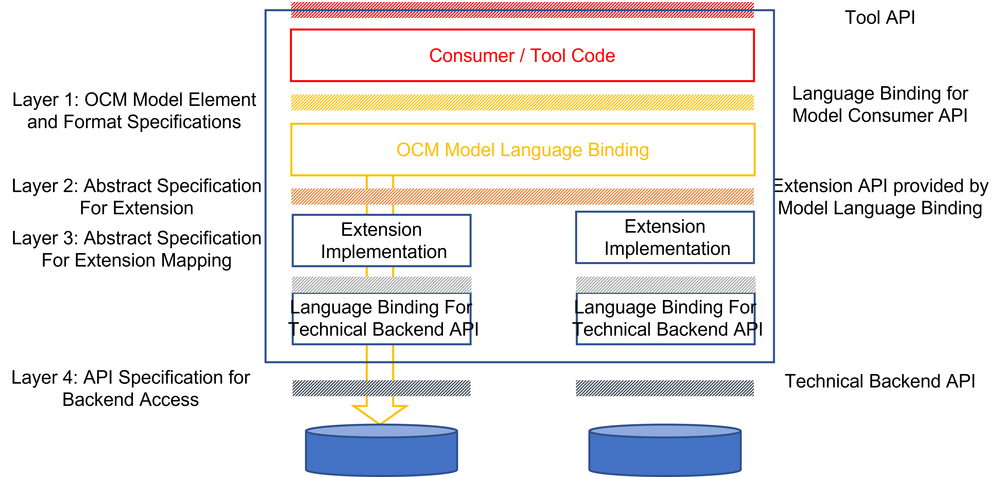

# Storage Backend Mappings

The OCM specification describes an interpretation layer on-top of
well-known storage backend technologies used to store OCM component versions.

Therefore, for every supported storage technology a dedicated mapping 
of OCM model elements to backend elements must be defined to ensure
the interoperability of different OCM implementations.

These mappings describe:
- the repository specification [type](../../01-model/07-extensions.md#repository-specification)
  and data stricture used to specify a dedicated repository instance
- the mapping of the [OCM elements](../../01-model/02-elements-toplevel.md) 
  to the elements provided by the storage technology.
- the mapping of the abstract model operations to the appropriate backend
  operations

Mappings for the following technologies are defined:

| STORAGE BACKEND | DESCRIPTION |
|-----------------|-------------|
| [OCIRegistry](oci.md)                                  | OCM content in OCI registries
| [FileSystem (CTF)](ctf.md)                             | OCM content as filesystem structure
| [FileSystem (Component Archive)](component-archive.md) | Single component version as content as filesystem structure
| [AWS S3](s3.md)                                        | OCM content in AWS S3 buckets

Depending on the used language binding for the OCM model (for example the
[reference implementation in Go](https://github.com/open-component-model/ocm))
an appropriate binding-specific embedding of this mapping must be provided.

The following diagram illustrates the embedding of implementation based
extensions (like for the storage backends) into a dedicated language
binding to achieve interoperability among those implementations.

- *Layer 1* contains the specification of the OCM model. A dedicated language binding provides an API implementation according to this specification. This API is then used by consumers requiring access to OCM component versions in a dedicated programming language (model language binding).

- *Layer 2* is the abstract extension specification with formats and
  operations. Here, it specifies how to embed storage backends
  technologies. (language independent)

- *Layer 3* is the abstract specification of the extension mapping for a
  dedicated backend technology, describing how extension elements and
  operations are mapped to a dedicated backend technology.
  Based on this specification an implementation is provided, which
  implements the language binding specific incarnation of the extension
  API (provided by the implementation of layer 1) to an appropriate
  language binding for the backend API.

- *Layer 4* is finally the API layer of a concrete supported storage
  backend. The driver implements the abstract storage backend mappin
  supporting the actual model embedding based on a language binding for the
  backend storage technology.

 

 
The specification for layer 1 is described in the [model element specification section](../../01-model/README.md).
The specification of the extension points can be found [here](../../01-model/07-extensions.md). The storage backend extension specification is [here](../../01-model/07-extensions.md#storage-backends).

This sections describes the abstract model mapping for the storage backend extensions according to layer 3. Different implementations (for different language bindings) must implement this mapping to achieve interoperability among different environments. 