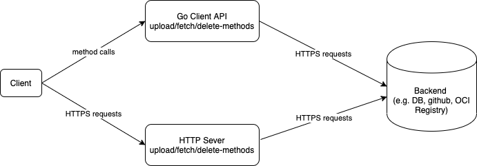

# Component Repository Specification

*Component Descriptors* are stored in *Component Repositories*. This chapter describes in a programing language/protocol
agnostic fashion the functions a *Component Repository* MUST implement to be OCM conform. A *Component Repository* MUST
implement a method to upload and a method to fetch uploaded *Component Descriptors*. A *Component Repository* MAY
implement a method to delete uploaded *Component Descriptors*.

This specification makes no assumptions and regulations about how *Component Repositories* will be implemented. Possible
realizations are:

- The *Component Descriptors* could be stored in different backends like OCI registry, a github repo, a data base etc.
- A facade/proxy API layer on top of the backend, implementing the upload, fetch and delete methods according to the
requirements of this specification. This could be a Go/Python client API, some http server... 

## Functions for Component Descriptors

### UploadComponentDescriptor

A *Component Repository* MUST provide a method to upload *Component Descriptors*. 

**Description**: Uploads a *Component Descriptor* to the *Component Repository*. If successful, the *Component Descriptor*
is accessible by its name and version (see GetComponentDescriptor). The name and version of a *Component Descriptor*
is the identifier of a *Component Descriptor*, therefore if there already exists a *Component Descriptor*
with the same name and version, the upload fails. 

A *Component Repository* SHOULD check if all referenced *Component Descriptors* and local blobs are already stored in 
the *Component Repository*. Local blobs are special artifacts stored in a *Component Repository*, described in more 
detail in the next chapter.

If the identifier of entries in *resources*, *sources* or *componentReferences* are not unique, as described before,
an *invalidArgument* error MUST be returned.

If the identifier of *resources* and *sources* (name plus extraIdentity) are not unique, a *Component Repository* might 
automatically add the version field to the extraIdentity to resolve this problem. Of course, it MUST still fail, if 
uniqueness of the resource identifiers could not be achieved this way.

If the last entry in the "repositoryContext" field is not an entry for the current *Component Repository*, such an 
entry is automatically added.

**Inputs**:

- String componentDescriptor: JSON or YAML representation of the *Component Descriptor*

**Outputs**:

- Bool: true if upload was successful 

**Errors**:

- alreadyExists: If there already exists a *Component Descriptor* with the same name and version
- missingReference: If a referenced *Component Descriptor* or local blob does not exist in the *Component Repository*
- invalidArgument: If the parameter *componentDescriptor* is missing or is not conform to the
  [specified json schema](component-descriptor-v2-schema.yaml)
- repositoryError: If some error occurred in the *Component Repository*

### GetComponentDescriptor

A *Component Repository* MUST provide a method to fetch uploaded *Component Descriptors*.

**Description**: Returns the *Component Descriptor* as a YAML or JSON string according the 
[JSON schema](component-descriptor-v2-schema.yaml).

**Inputs**:

- String name: Name of the *Component Descriptor*
- String version: Version of the *Component Descriptor*

**Outputs**:

- String: YAML or JSON string of the *Component Descriptor*

**Errors**:

- invalidArgument: If one of the input parameters is empty
- doesNotExist: If the *Component Descriptor* does not exist
- repositoryError: If some error occurred in the *Component Repository*

### ListComponentDescriptors

A *Component Repository* MUST provide a method to list the uploaded *Component Descriptors*.

**Description**: Returns an iterator over all name-version-pairs of all stored *Component Descriptors*.

**Inputs**:

**Outputs**:

- Iterator over name-version pairs: Iterator over name and version pairs

**Errors**:

- repositoryError: If some error occurred in the *Component Repository*

### DeleteComponentDescriptor

A *Component Descriptor* defines the artefacts of a component version and many processes rely on this information.
Therefore, *Component Descriptors* uploaded to a *Component Repository* SHOULD be immutable. Nevertheless, a
*Component Repository* MAY provide a method to delete *Component Descriptors*.

**Description**: Deletes the *Component Descriptor*. The deletion of a *Component Descriptor fails if it is referenced 
by another *Component Descriptor*.

**Inputs**:

- String name: Name of the *Component Descriptor*
- String version: Version of the *Component Descriptor*

**Outputs**:

**Errors**:

- doesNotExist: If the *Component Descriptor* does not exist
- existingReference: If the *Component Descriptor* is still referenced
- invalidArgument: If one of the input parameters is empty
- repositoryError: If some error occurred in the *Component Repository*

## Concurrency and ACID 

This specification makes no assumptions about the behaviour of a *Component Repository* in case of parallel requests.
For example if you upload *Component Descriptor* nothing is said about the behaviour in case of the parallel deletion
of a referenced *Component Descriptor*.

Also, assumptions with respect to atomicity and durability are out of scope of this document.