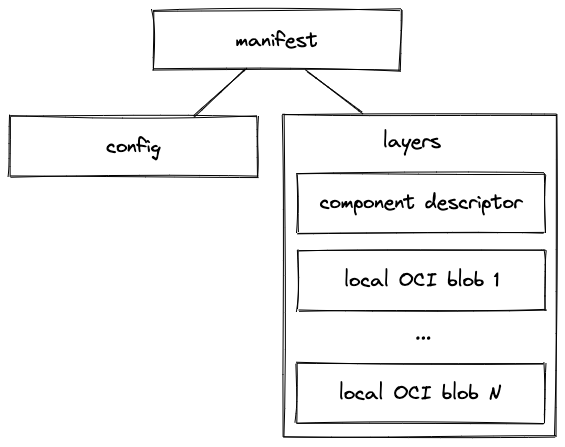

# OCI Component Repository

This chapter describes an implementation of a Component Repository which stores component descriptors in an OCI image 
registry. We call this implementation *OCI Component Repository*.

An OCI component repository is defined by a *base URL*. This URL MUST refer to an OCI image registry or a path
into it. Component descriptors can be stored here as OCI artifacts. The name of the artifact is derived from the 
base URL, the component name, and component version:

```text
<base URL>/component-descriptors/<component name>:<component version>
```

A component descriptor can reference resources of type `localBlob`. These resources are stored as blobs in the same 
OCI artifact as the component descriptor. The artifact is the structured as follows. It consists of a manifest, 
a config, and an array of layers. The component descriptor is the first layer, and the local OCI blobs are stored in the 
other layers. 



The component descriptor and its local OCI blobs can be accessed via the OCI blobs endpoint of the repository.
To get a layer via the OCI blobs endpoint one needs to know the digest of this layer.

The digest of the component descriptor layer can be found in two ways. It is the first layer in the manifest. 
In addition, the config of the artifact contains a reference to the component descriptor layer, as shown in the 
following example of a config.json:

```json
{
    "componentDescriptorLayer": {
        "mediaType": "application/vnd.gardener.cloud.cnudie.component-descriptor.v2+yaml+tar",
        "digest": "sha256:6303ce21c1c8b5a9dfd9d6616cce976558d84542ac2eca342e3267f7205f2759",
        "size": 3584
    }
}
```

The digest of a local OCI blob can be found in field `access.digest` of the resource in the component descriptor:

```yaml
resources:
  - name: example-resource
    ...
    access:
      digest: <digest of the local OCI blob>
      type: localBlob
```
