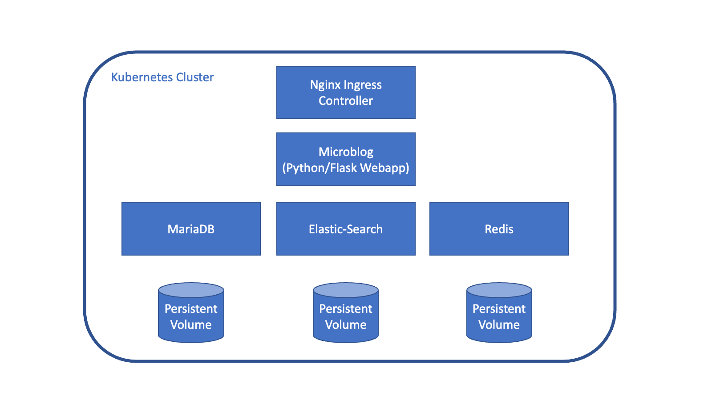

# Structuring Software with OCM

- [Structuring Software with OCM](#structuring-software-with-ocm)
  - [Introduction](#introduction)
  - [Example](#example)
    - [Helm Charts](#helm-charts)
    - [Input Specification](#input-specification)
    - [Building the Common Transport Archive](#building-the-common-transport-archive)

## Introduction

In this specification software products are comprised of logical units called
[**components**](../../specification/elements/README.md#components). A component version
consists of a set of technical [artifacts](../../specification/elements/README.md#artifacts), e.g. Docker images, Helm charts, binaries, configuration data etc.
Such artifacts are called **resources** in this specification. Resources are usually built
from something, e.g. code in a git repo. Those are named **sources** in this specification.

OCM introduces a **Component Descriptor** for every component version, that
describes the resources, sources and other component versions belonging to a particular
component version and how to access them.

Usually however real-life applications are composed of multiple components. For
example an application might consist of a frontend, a backend, a database and a web server.
During the software development process new [**component versions**](../../specification/elements/README.md#component-versions)
are created and third-party components might be consumed from a public registry and
updated from time to time.

Not all component version combinations of frontend, backend, database etc.are
compatible and form a valid product version. In order to define reasonable
version combinations for the software product, we could use another feature of
the *Component Descriptor*, called component reference (or reference in short) which allows
the aggregation of component versions.

For each component and each version in use there is a *Component Descriptor*. For the
entire application we introduce a new component that describes the overall software
product referencing all components. This describes the entire application.

A particular version of this application is again described by a *Component Descriptor*,
which contains references to *Component Descriptors* of its components in their version in
use. You are not restricted to this approach. It is e.g. possible to create multi-level
hierarchies or you could just maintain a list of component version combinations which build
a valid product release.

In a nutshell OCM provides a simple approach to specify what belongs to a product version.
Starting with the *Component Descriptor* for a product version and following the component
references, you could collect all artifacts, belonging to this product version.

## Example

Let's illustrate this idea by an example. As base we use the 'microblog' application. This
application was created for a programming tutorial and is documented in detail [here](https://blog.miguelgrinberg.com/post/the-flask-mega-tutorial-part-i-hello-world). The source code can be found [here](https://github.com/miguelgrinberg/microblog/).

At the end of the tutorial this application consists of the following components:

* Microblog application written in Python
* A database MySQL or MariaDB
* A full-text search engine elasticsearch
* Redis to support task queues for background processing
* For a Kubernetes deployment and nginx ingress controller is needed in addition.

<div align="center">

</div>

Following the guideline above we will end-up with six component versions: Five are created
for the components in this list. And one component is created describing the application
deployment and referencing all the sub-components. Looking closer at the components we can encounter three different flavors:

* The deployment component describing a product release and referencing all used components
* The main application component consisting of source code and  to a container image.
* Third party components consumed as binaries located in a public repository.

For building composed components the ["All-in-one"](../getting-started/README.md#all-in-one)
mechanism becomes handy.

### Helm Charts

Kubernetes deployments often use helm charts. The OCM specification supports helm charts as
an artifact type. For the microblog application we will create out own helm chart. For the
third-party components we will use readily available helm charts from public helm chart
repostories.

The OCM CLI supports referencing helm charts being stored in an OCI registry. However most
publicly available helm charts currently are available from helm chart repositories and
not from OCI registries. Therefore the helm charts are embedded in the component archive.
This can easily be achieved with the helm CLI:

```
helm repo add <repo-name> <helm-chart-repo-url>
helm pull --destination <target-dir> <repo-name/chart-name>
```

Example:
```
helm repo add bitnami https://charts.bitnami.com/bitnami
helm pull --destination . bitnami/mariadb
```
The helm chart for mariadb is then stored in the current working directory as `mariadb:11.4.5.tgz` and can be referenced as path from there in the `components.yaml` file (see below).

The helm chart for the microblog application is our own and part of the source code. It is
not downloaded from a public repository.


### Input Specification

The corresponding input file for building the component version (`components.yaml`) will then look like this:

```yaml
components:
# Deployable component: microblog-deployment
# - contains application and references all runtime dependencies
# - used as root component to deploy the complete application
# - version numbering scheme follows the main application
- name: ${COMPONENT_NAME_PREFIX}/microblog-deployment
  version: ${VERSION}
  provider:
    name: ${PROVIDER}
  componentReferences:
  - name: microblog
    componentName: ocm.software/microblog/microblog
    version: ${VERSION}
  - name: nginx-controller
    componentName: ocm.software/microblog/nginx-controller
    version: ${NGINX_VERSION}
  - name: mariadb
    componentName: ocm.software/microblog/mariadb
    version: ${MARIADB_VERSION}
  - name: elasticsearch
    componentName: ocm.software/microblog/elasticsearch
    version: ${ELASTIC_VERSION}
#
# Main application component: microblog
# - has a source repository and compiles its own images
- name: ${COMPONENT_NAME_PREFIX}/microblog
  version: ${VERSION}
  provider:
    name: ${PROVIDER}
  sources:
  - name: source
    type: filesytem
    access:
      type: github
      repoUrl: github.com/acme.org^/microblog
      commit: ${COMMIT}
    version: ${VERSION}
  resources:
  - name: microblog-chart
    type: helmChart
    input:
      type: helm
      path: ../microblog-helmchart
  - name: microblog-image
    type: ociImage
    version: ${VERSION}
    input:
      type: dockermulti
      repository: microblog
      variants:
      - microblog:${VERSION}-linux-amd64
      - microblog:${VERSION}-linux-arm64
#
# Nginx-Controller Component
# - runtime dependency, use pre-built images, embeds helm chart
- name: ${COMPONENT_NAME_PREFIX}/nginx-controller
  version: ${NGINX_VERSION}
  provider:
    name: ${PROVIDER}
  resources:
  - name: nginx-controller-chart
    type: helmChart
    input:
      type: helm
      path: nginx/ingress-nginx-${NGINX_CHART_VERSION}.tgz
  - name: nginx-controller-image
    type: ociImage
    version: ${NGINX_VERSION}
    access:
      type: ociArtifact
      imageReference: registry.k8s.io/ingress-nginx/controller:v${NGINX_VERSION}
#
# Maria-DB Component
# - runtime dependency, use pre-built images, embeds helm chart
- name: ${COMPONENT_NAME_PREFIX}/mariadb
  version: ${MARIADB_VERSION}
  provider:
    name: ${PROVIDER}
  resources:
  - name: mariadb-chart
    type: helmChart
    input:
      type: helm
      path: mariadb/mariadb-${MARIADB_CHART_VERSION}.tgz
  - name: mariadb-image
    type: ociImage
    version: ${MARIADB_VERSION}
    access:
      type: ociArtifact
      imageReference: bitnami/mariadb:${MARIADB_VERSION}-debian-11-r12
#
# Elasticsearch Component:
# - runtime dependency, use pre-built images, embeds helm chart
- name: ${COMPONENT_NAME_PREFIX}/elasticsearch
  version: ${ELASTIC_VERSION}
  provider:
    name: ${PROVIDER}
  resources:
  - name: elasticsearch-chart
    type: helmChart
    input:
      type: helm
      path: elastic/elasticsearch-${ELASTIC_VERSION}.tgz
  - name: elasticsearch-image
    type: ociImage
    version: ${ELASTIC_VERSION}
    access:
      type: ociArtifact
      imageReference: docker.elastic.co/elasticsearch/elasticsearch:${ELASTIC_VERSION}

```

Some frequently changing parameters have been extracted as variables. The OCM CLI uses
templating to fill them with values. The templating mechanism is described
[here](../getting-started/best-practices.md#templating-the-resources). For this example
we use the simple (default) template engine type `subst`.

Note the differences between the various components:

* The microblog-deployment is the root and contains only references to other components
* The microblog application is the main application, built from sources. It has `sources`.
* The microblog application consists of an image and a helm chart. The image is built in
  previous build step (not described here) and taken from the local docker registry. The
  two images for different architectures are converted to a multi-arch image.
* All other components are third-party components and referenced from public registries.

### Building the Common Transport Archive

From the input file `components.yaml` the common transport archive can be created with the
OCM CLI. For all variables we need to provide values. Variable values can be passed in the
command line or stored in a file. For many variable having a values file is more convenient.
The corresponding file `settings.yaml` may look like this:

```yaml
VERSION: 0.23.1
COMMIT: 5f03021059c7dbe760ac820a014a8a84166ef8b4
NAME: microblog
COMPONENT_NAME_PREFIX: github.com/acme.org/microblog
PROVIDER: acme.org
ELASTIC_VERSION: 8.5.1
MARIADB_VERSION: 10.6.11
MARIADB_CHART_VERSION: 11.4.2
NGINX_VERSION: 1.5.1
NGINX_CHART_VERSION: 4.4.2
```

Create the transport archive then with:

```shell
ocm add componentversions --create --file <ctf-target-dir> --settings settings.yaml components.yaml
```

You can view the generated component descriptor using the command:

```shell
ocm get component -o yaml <ctf-target-dir>
```

You can store the transport archive in an OCI registry (this step needs a proper
configuration of credentials for the OCM CLI):

```shell
ocm transfer ctf -f <ctf-target-dir> <oci-repo-url>
```

Note: Be careful with the `-f` or `--overwrite` flag. This will replace existing component
versions in the OCI registry. During development it is useful being able to overwrite
existing component versions until something is ready for release. **For released versions
you should never use this flag**! Released component versions should be immutable and
should never be overwritten. They serve as source of truth for what the release is made of
und should never be changed.
