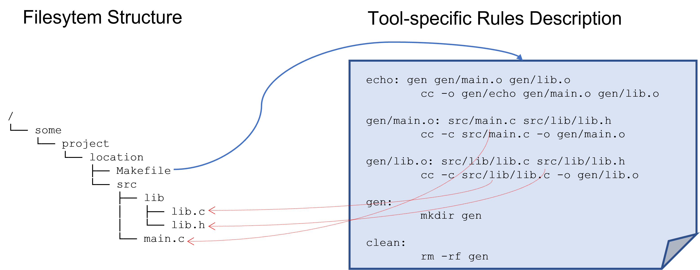
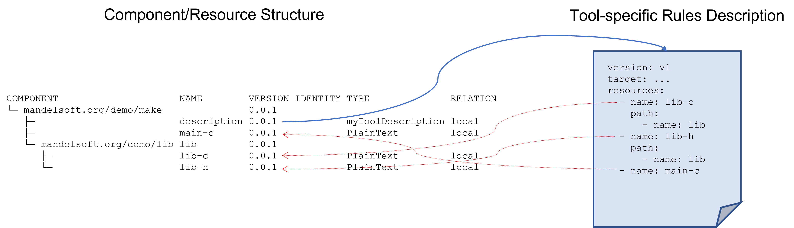

# 2.3 Model Contract

The value of the plain Open Component Model is very limited. It comes
with the tools interacting with the Model and its content.

A first example for such a tool is the [transport](../../introduction/transports.md) tool provided directly
by the OCM Command line client. It used the access information of resources contained in a component version to copy software artifacts from one environment into another.

Another example could be a deployment tool accessing a component version to determine the artifacts, which should be deployed into
a target environments.

Such tools and their specification ar not part of the OCM specification. Nevertheless, they have to interact with the content described by the Open Component Model.

To do so, there must be a clear contract between the model and the way tools interact with the model.

There are two basic parts for this contract:
- All content required to deploy and install software described by a component version must be described as resources by this component version.
- All resource locations (e.g. image locations) used in a runtime environment must be taken directly or indirectly from the access information provided by the used component versions.

This is required to fulfill the promise made by the Open Component Model:

*Being able to describe closed Software Bills of Delivery enabling the transport of software from one environment into another one, and the deployment of this software in decoupled or isolated target environments.*

This has various consequences especially for deployment environments,
but basically for all tools working with the component model and even the component model itself:

- (Deployment) Descriptions for dedicated tools describing software artifacts used by these tools must be part of a component version. They have to be stored as additional resources with an appropriate own artifact type.
- Those descriptions must use description elements based on the component model to denote those artifacts. It is not possible anymore to describe explicit, absolute or global artifact locations.
- Even component names or versions must not be used, because they would
  impede the possibility of other tools to detect the complete set of required artifacts (for example for the transport tool)
- To avoid the need of describing always complete closed sets of artifacts the model must be able to aggregate/include artifact sets provided by other component versions. This directly motivates the [component reference](../elements/README.md#aggregation) feature of a component version.
- A component version must include all resources, either by resources directly described by the component version or by referring to other component versions recursively describing these resources.
- The artifacts described by such a tool specific description must be resolvable in the context of the component version containing this description as artifact.
- This directly leads to the notion of [relative artifact references](../elements/README.md#artifact-references). The denotation of described artifacts is always given by a sequence of reference identities and a final resource [identity](../elements/README.md#identities). This sequence leads, starting from the initial component version, following the component references, to the component version finally containing the resource. This path does not contain any absolute component names, but only relative names or better identities described by the dedicated component version.
- The same rules that apply to description artifacts, also apply to artifacts used as executable entity (container image or plain executable). This means, even those artifacts must not use artifact locations provided during their build/production process. (For example,
  a container image intended to deploy other executable elements must not use hard-wired resource locations). Instead, the deployment of such an element must be fed with configuration data describing those locations, finally taken from the component version describing the deployment of this element. So, the task of a deployment tool is to extract this information from the actually used component version and provide appropriate input for the executable entity.

## Comparison with well-known environments

Let's motivate all this by comparing it with some well-known technology having similar requirements: the Filesystem and a file based build technology like *make*.

### Filesystem based Build Tool

The filesystem is a hierarchical namespace used to address named content described by files organized in directories.

*Make* is tool executing some build steps of a source structure.
The build description is stored on a *Makefile*.

A simple example could look like this:

```go
/
└── some
    └── project
        └── location
            ├── Makefile
            └── src
                ├── lib
                │   ├── lib.c
                │   └── lib.h
                └── main.c
```

The filesystem path `/some/project/location` contains the files belonging to the build projects, described by the *Makefile* in this directory. The sources are contained in a subdirectory `src`, which again has a deep structure.

You can produce the executable `echo` by switching to the folder `/some/project/location` and executing `make`.

How does the Makefile denote files relevant for the build steps? Let's have a look into this file.

**Makefile**:
```make
echo: gen gen/main.o gen/lib.o
        cc -o gen/echo gen/main.o gen/lib.o

gen/main.o: src/main.c src/lib/lib.h 
        cc -c src/main.c -o gen/main.o

gen/lib.o: src/lib/lib.c src/lib/lib.h
        cc -c src/lib/lib.c -o gen/lib.o

gen:
        mkdir gen

clean: 
        rm -rf gen
```

You can see, that the file resources are denoted by path names relative
to the directory containing the Makefile. Why is done this way instead of using absolute path names? Using such relative path names allow to package
the complete project (for example with `cd /some/project/location; tar cvf ../echo.tar .`). You can take this archive and transport into onto another host and unpack it under some arbitrary directory (for example `cd /my/local/echo; tar xvf echo.tar`). Just executing `make` again, build your echo command in the new location.

<div align="center"> 

</div>

This is basically the same scenario we have to solve with the Open Component Model and tools working with provide content.

### How does it look like in the Open Component Model

The component model describes a hierarchical namespace for component versions. Component versions are stored in a component repository.  The component version describes resources like files in a filesystem folder. The component version references can be seen as counterpart to sub folders in a filesystem (better: symbolic links).

Our make project is comparable to the content of a component version.
The substructure maps to a sequence of component references.

The *Makefile* is a description used by the tool *make* it refers to filesystem resources. A tool acting on the component model works exactly the same way. The description used to control the functionality of the tool is stores as artifact in the toot component version. It describes the required resources in means of the component model by using relative artifact references following the reference sequence of aggregated component version up to the file resource.

Such a description could look like this:

**Description Resource**:
```
version: v1
target: ...
resources:
  - name: lib-h
    path:
      - name: lib
  - name: lib-c
    path:
      - name: lib
  - name: main-c
```

It is based on a component structure looking like this:

```
COMPONENTVERSION                        NAME        VERSION IDENTITY TYPE              RELATION
└─ mandelsoft.org/demo/make:0.0.1                                                      
   ├─                                   description 0.0.1            myToolDescription local
   ├─                                   main-c      0.0.1            PlainText         local
   └─ mandelsoft.org/demo/lib:0.0.1                                                    
      ├─                                lib-c       0.0.1            PlainText         local
      └─                                lib-h       0.0.1            PlainText         local

```

A library component `mandelsoft.org/demo/lib` contains some library resources (for sure dedicated files of an archive would never be represented as dedicated resources in a component version, this is just an example illustrating the similarities to our make scenario).

This top level component `mandelsoft.org/demo/make:0.0.1` contains a resource `description` for the tool specific description file and some
top-level resource `main-c` This resource and the two library resources
are described by the description file, above, using resource references relative to the component version hosting the description file, like a *Makefile* described relative file paths to denote the required resources in the directory structure. 


<div align="center"> 

</div>
